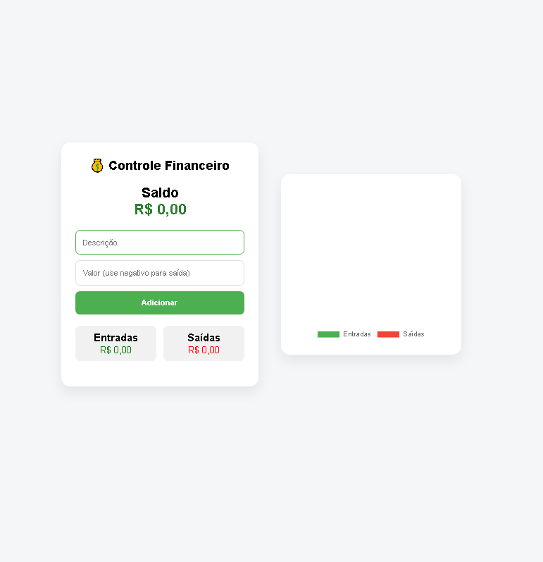
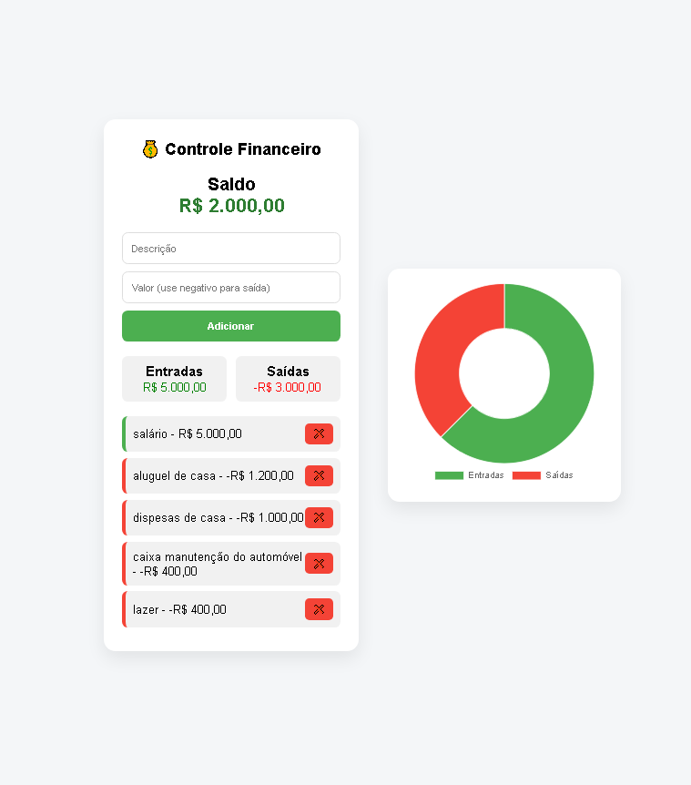

# 💰 Controle Financeiro

## 📸 Preview do Projeto

Aplicação web simples e funcional para controle de finanças pessoais, permitindo registrar entradas e saídas, visualizar saldo total e acompanhar os gastos através de um gráfico dinamico.

---

## 🚀 Funcionalidades

* ✅ Adicionar receitas e despesas
* ✅ Remover transações
* ✅ Cálculo automático de saldo
* ✅ Separação de entradas e saídas
* ✅ Persistência de dados com LocalStorage
* ✅ Gráfico interativo com Chart.js

---

## 🛠️ Tecnologias utilizadas

* HTML5
* CSS3
* JavaScript (Vanilla JS)
* Chart.js

---

## 📌 Melhorias futuras

* 📅 Filtro por mês
* 📈 Gráficos mais detalhados
* 🔐 Sistema de login
* ☁️ Integração com banco de dados

---

## 🙋‍♂️ Autor

Desenvolvido por **Aldair Guedes**

📧 Email: [aldairguedessilvao@gmail.com](mailto:aldairguedessilvao@gmail.com)
📱 WhatsApp: (11) 95773-5271

---

## ⭐ Sobre o projeto

Este projeto foi desenvolvido com o objetivo de praticar e demonstrar habilidades em desenvolvimento web, com foco em JavaScript e manipulação de dados no front-end.

---

